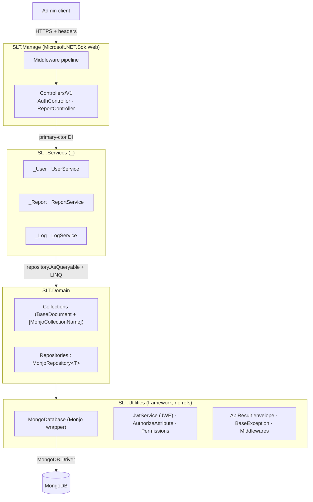

# Architecture — SLT.Manage

## Overview

`SLT.Manage` is a classic **N-tier layered** ASP.NET Core Web API on .NET 8 — **not** Clean
Architecture, DDD, CQRS, or EF. Four projects with a strict one-way dependency chain; data lives
in MongoDB accessed through a hand-rolled wrapper ("Monjo"). The service is **read-only over
reporting**: it queries the same collections the public `slt.api` writes, and does no on-chain work.



Dependency direction is strictly `SLT.Manage → SLT.Services → SLT.Domain → SLT.Utilities`.
`SLT.Utilities` references nothing.

## Middleware pipeline (verbatim, from `Program.cs`)

Registration order — note `UseRequestLogger` runs **before** the exception handler and **before all
auth**, which is why it captures full request bodies and headers (see SECURITY.md):

```
UseHsts
UseDeveloperExceptionPage          (Development only — receives app.Environment)
UseSwaggerAndUI                    → Swagger + UI, served in ALL environments (no env gate)
UseRequestLogger                   → persists request body + headers to RequestLogs
UseCustomExceptionHandler          → catches BaseException → ApiResult + Sentry
UseJWTBlackList
UseProductionCors
UseFirewall                        → IP/network gate (default allow-all unless prod tightens)
UseSignature                       → per-application HMAC + nonce gate (ApplicationId/Signature/Nonce)
UseJwt                             → parse + validate JWE, stash token in HttpContext.Items["Token"]
UseRouting
UseCustomRateLimiting
UseAuthorization                   → custom [Authorize] permission-code check
UseEndpoints
```

DI is wired before `Build()`: `AutofacServiceProviderFactory` + two marker scans —
`AddServices()` (scans the `SLT.Utilities` assembly) and `AddControllerServices()` (scans the
`SLT.Domain` + `SLT.Services` assemblies).

## Request lifecycle (a report read)

1. Client POSTs to `api/v1/Report/<Action>` with headers `ApplicationId`, `Nonce`, `Signature`,
   and `Authorization: Bearer <JWE>`, plus a `[FromBody]` `*Update` DTO.
2. Firewall (IP) → Signature (per-app HMAC + nonce replay window) → Jwt (decrypt/validate, stash token).
3. Routing dispatches to the controller action; rate limiting applies.
4. The custom `[Authorize(Permissions.Reporter)]` filter reads the token's `Permission` claim and
   (by default) requires `UserStatus == Active`; throws `AuthorizationException` otherwise.
5. The controller delegates one line to the service; the service runs `repository.AsQueryable()` + LINQ
   (soft-delete filtered automatically), paginates, and returns a `*Result`/`*Overview` DTO.
6. `[ApiResultFilter]` wraps the DTO in `ApiResult<T>`; on failure `CustomExceptionHandlerMiddleware`
   maps the `BaseException` to its HTTP status + `ApiResult` and reports to Sentry.

## Monjo data flow

Entities subclass `BaseDocument` (`Id`, `CreatedMoment`, `ModifiedMoment`, soft-delete `IsDeleted`/
`DeletedMoment`) and carry `[MonjoCollectionName("...")]`. `MonjoRepository<T>` resolves the collection
name by reflection, and **every read ANDs `!IsDeleted`** (`AsQueryable`, `FilterBy`, `Find*`). Writes stamp
`ModifiedMoment`; `Delete*` are soft (set `IsDeleted=true`); the only hard delete is `RealDeleteManyAsync`
(used by log retention). `MonjoQuery`/`MonjoFilteredResult` provide a paging/filter DSL.

## Auth layers (defense in depth)

1. **Network** — `FirewallMiddleware` allows/denies by IP regex rules.
2. **Per-application** — `SignatureMiddleware` requires `ApplicationId` + `Signature` (+ `Nonce`) on
   **every request except two hardcoded SignalR hub paths** (`/hubs/prices`, `/hubs/NotifyWallet` — neither
   exists in this admin repo, so effectively all requests); matched against `ApplicationPoolSettings.Applications`. A `MasterSignature` bypasses the
   nonce/HMAC check; otherwise the nonce must be unused (5-min window) and the HMAC verified against the
   app's `PreSharedKey`. This runs **before** user auth.
3. **User JWE** — `JwtService` issues a signed (HMAC-SHA256) **and** encrypted (AES-128) token with
   `ClockSkew = Zero`. `JwtMiddleware` parses/validates it; the custom `[Authorize]` filter then gates on
   **permission code** strings carried as `Permission` claims.

## "Blockchain" here = data only

There are **zero chain client libraries** (no Nethereum / web3 / TronNet / RPC SDK). Chain data exists only
as persisted Mongo records — `Invoice` (`TokenSymbol`, `TokenAddress`, `PaymentHash`, `RegisterHash`,
`USDTAmountInWei`, ...), `Order` (`OwnerWallet`, `PayerWallet`), `TransactionLog` (`Hash`, `BlockNumber`,
`BlockchainEventType`). Reports read and aggregate these. The `AvailableTokensSettings` config section (BSC
tokens `SLT`/`LUSD`) is **inherited from `slt.api` and bound by no `RegisterSetting<>` here** — it is not consumed.

---

## Architecture Assessment

Honest read of strengths, smells, and risks. Grounded in the code.

### Strengths

- **Clean, enforced layering.** The `Api → Services → Domain → Utilities` chain is one-directional and the
  dependency boundaries are real. The thin-controller / delegate-to-service convention is consistent.
- **Uniform response contract.** Every response is an `ApiResult`/`ApiResult<T>` via `[ApiResultFilter]` +
  `CustomExceptionHandlerMiddleware` — predictable for clients and easy to reason about.
- **Soft-delete is centralized**, not scattered — baked into `MonjoRepository`, so individual queries can't
  accidentally leak deleted rows.
- **Defense in depth** at the edge (firewall + per-app signature + JWE user auth + permission codes).

### Smells / risks

- **CRITICAL — committed secrets** in `SLT.Manage/appsettings.json` (Mongo creds, JWT signature/encryption
  keys, client secrets, per-app pre-shared keys + master signatures). See SECURITY.md.
- **`NotFoundException(string)` returns HTTP 500, not 404.** The envelope's `statusCode` says `NotFound`
  while the HTTP status is 500 — confusing for callers. Use the `(ApiResultStatusCode, string)` overload.
- **Sensitive request logging.** `RequestLoggingMiddleware` persists full request bodies and all headers
  (including `Authorization`) to the `RequestLogs` collection for every `/api` call.
- **Allow-all firewall default** (`Regex "^(.*)$"`, `IPAddresses ["*"]`, `Policy Allow`) — open unless prod
  config tightens `FirewallSettings__Rules`.
- **`MasterSignature` bypass + a `test`/`test`/`test` app** in the committed pool fully skip replay protection
  for any holder.
- **Empty `catch {}`** swallows JWT validation errors in the logging middleware, and `UserService.CreateAdminAsync`
  returns `false` on any exception — failures are silent and undiagnosable.
- **Partial safety net.** A GitLab CI pipeline (`.gitlab-ci.yml`, see [CI.md](CI.md)) now guards every
  MR with a Release build + an advisory csharpier check (Roslyn analyzers as warnings, package versions
  centralized in `Directory.Packages.props`); deploy is a manual-gated job on a self-hosted runner.
  There is **still no test project** — recommend adding an xUnit project, then graduating the format
  check and `TreatWarningsAsErrors` to blocking once the baseline is clean.
- **Copy-paste framework drift.** `SLT.Utilities` is duplicated (not packaged) across `slt.api`/`slt.manage`;
  fixes (e.g. the NotFoundException-500 ctor) must be applied in each repo independently.
- **Vestigial code.** `WeatherForecast.cs` (unused scaffold), the commented-out `CreateAdminAsync` seed
  endpoint, the empty `AddSettings()` stub, and the unbound `AvailableTokensSettings` section add noise.
- **Short symmetric JWT key** (`EncryptionKey` "must be 16 character", AES-128) — minimal key length.

### Recommendations (priority order)

1. **Rotate the committed secrets**, move all values to env/secret store (compose already parameterizes them
   in prod), and scrub the committed defaults from `appsettings.json`.
2. Fix the `NotFoundException` HTTP-500 trap (or make the `(status, msg)` ctor the default path).
3. Redact `Authorization`/secret headers + bodies before persisting `RequestLogs`, and add retention.
4. Replace empty `catch {}` blocks with logged handling.
5. Tighten the production firewall rules and remove the `test` app + reconsider `MasterSignature`.
6. Add a minimal xUnit test project (the build/CI gate already landed — see [CI.md](CI.md)); consider
   extracting `Utilities` to a shared package to end the copy-paste drift.
